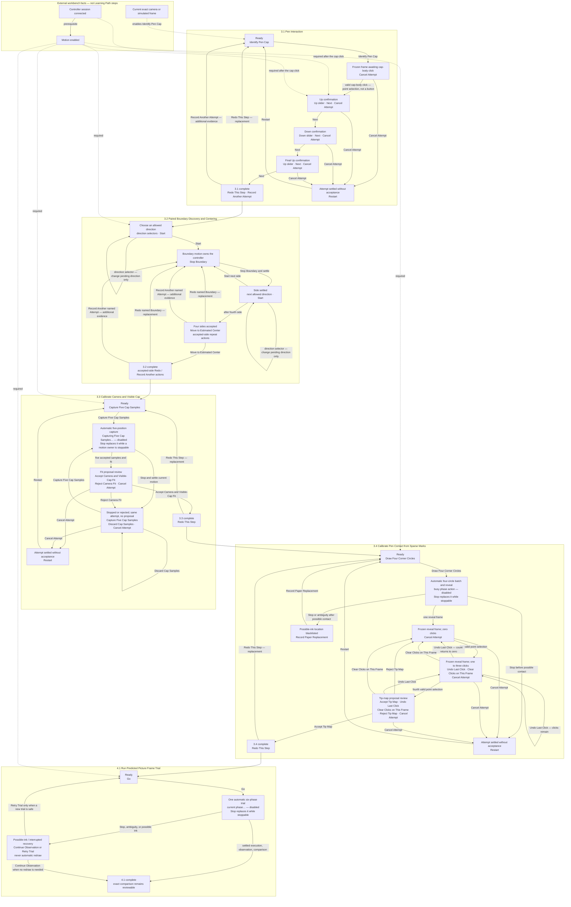

# Learning Path Button Transitions

This diagram inventories the buttons owned by the Learning Path action strip and
the state reached by each normal click. **Connect** and **Enable Motion** belong
to the workbench toolbar, so they are dependencies shown outside the Learning
Path rather than navigator rows or exercise transitions.

Dependency behavior is intentionally asymmetric:

- `motion enabled` implies `controller session connected`;
- **Identify Pen Cap** requires only a current exact frame;
- after the cap click, the first **Next** and its servo slider remain visible but
  disabled until connection and Motion authorization exist;
- 3.2, 3.3, 3.4, and 4.1 expose their normal exercise action in place, disabled
  with the exact missing workbench dependency;
- satisfying a dependency enables the existing action. It never inserts a
  Learning Path **Connect**, **Enable Motion**, **Start**, **Continue**, or
  acceptance step.

The two normal-flow acceptance buttons are evidence commits, not forward gates:
**Accept Camera and Visible-Cap Fit** commits the five-sample registration, and
**Accept Tip Map** commits the four-click tip registration. Stage 3.3 begins
directly with **Capture Five Cap Samples**, and Stage 3.4 begins directly with
**Draw Four Corner Circles**; neither has a preceding generic **Start**.
