# Learning Path Button Transitions

This diagram inventories every normal Learning Path button and the state reached
by clicking it. **Connect** and **Enable Motion** belong to the workbench
toolbar. They are external prerequisites, not Learning Path stages, exercises,
or transitions.

The [workbench and portrait completion correction](EPISODE_ARCHITECTURE_EXECUTION_PLAN.md#workbench-and-portrait-completion-correction-2026-09-08)
passed full strict run 31, including saved-Learning restoration and held-Draw
Stop/publication: 997 Swift functions passed, five opt-in skips, zero failures.
Independent critic 9 found no blocking software issue, and the tested signed app
was delivered without launching. Native On/Off and Stop remain unverified because
signed-app attempts reached no controls in the locked GUI. The transitions below
retain their existing owners; docking and current Pen pose do not reset accepted
milestones. Current Evidence separates software acceptance and delivery from
native input, physical observation and Git landing.

Learning Path navigation and exercise controls share Guided Learning. Native
View-menu Show/Hide commands and each pane's close button change control
visibility only. Four slots fill right, left, lower-right, lower-left around a
permanent central canvas. Reopening uses the first vacant slot; a fifth opening
replaces the oldest visible control without discarding workflow state. Selecting
a workflow title explicitly selects its camera role. The session toolbar retains
exact Learning, Motion and Drawing Run Stop requests even with every control hidden.
Voice is window-local and remains available with Guided Learning hidden.
Buttons show press, pending, and result feedback. Stop uses its own symbol and
styling; ordinary choices do not encode Yes/No as green/red. Servo dragging
commits once on release, with Confirm visibly unavailable during settlement.

```mermaid
flowchart TD
  subgraph workbench["External workbench prerequisites — not Learning Path steps"]
    frame["Current exact camera or simulated frame"]
    connected["Controller session connected"]
    motion["Motion enabled"]
    connected -->|required before| motion
  end

  subgraph pen["1.1 Identify and Calibrate the Pen"]
    p0["Ready<br/>Identify Pen Cap"]
    p1["Frozen frame awaiting cap-body click<br/>Cancel Attempt"]
    p2["Set and verify Up<br/>Pen Up slider · Confirm Pen Up · Cancel Attempt"]
    p3["Set and verify Down<br/>Pen Down slider · Confirm Pen Down · Cancel Attempt"]
    p4["Verify return to Up<br/>Pen Up slider · Confirm Pen Up · Cancel Attempt"]
    p2a["Up confirmation admitted<br/>predecessor Confirm removed · exact Stop only"]
    p3a["Down confirmation admitted<br/>predecessor Confirm removed · exact Stop only"]
    p4a["Final Up confirmation admitted<br/>predecessor Confirm removed · exact Stop only"]
    pdone["1.1 complete<br/>Redo This Step · Record Another Attempt"]
    pcancel["Attempt settled without acceptance<br/>Restart Attempt"]
    p0 -->|Identify Pen Cap| p1
    p1 -->|valid cap-body point selection — not a button| p2
    p2 -->|Confirm Pen Up — publishes busy revision before waiting| p2a
    p2a -->|settled Up; advisory Down cue admitted without playback wait| p3
    p3 -->|Confirm Pen Down — publishes busy revision before waiting| p3a
    p3a -->|settled Down; advisory Up cue admitted without playback wait| p4
    p4 -->|Confirm Pen Up — publishes busy revision before waiting| p4a
    p4a -->|settled final Up| pdone
    p1 -->|Cancel Attempt| pcancel
    p2 -->|Cancel Attempt| pcancel
    p3 -->|Cancel Attempt| pcancel
    p4 -->|Cancel Attempt| pcancel
    pcancel -->|Restart Attempt| p0
    pdone -->|Redo This Step — replace accepted result| p0
    pdone -->|Record Another Attempt — retain additional evidence| p0
  end

  subgraph boundary["1.2 Measure and Center the Drawing Boundary"]
    b0["Choose an allowed direction<br/>direction selectors · Move Toward X−/X+/Y−/Y+"]
    b1["Moving toward selected side<br/>Stop Boundary Search"]
    b2["Side recorded<br/>next allowed direction · Move Toward direction"]
    b3["Four sides recorded<br/>Move to Estimated Center<br/>accepted-side repeat actions"]
    bdone["1.2 complete<br/>accepted-side Redo / Record Another actions"]
    b0 -->|direction selector — selection only| b0
    b0 -->|Move Toward direction| b1
    b1 -->|Stop Boundary Search and settle| b2
    b2 -->|direction selector — selection only| b2
    b2 -->|Move Toward next direction| b1
    b2 -->|after fourth side| b3
    b3 -->|Move to Estimated Center| bdone
    b3 -->|Redo named Boundary — replace accepted side| b1
    b3 -->|Record Another named Attempt — retain evidence| b1
    bdone -->|Redo named Boundary — replace accepted side| b1
    bdone -->|Record Another named Attempt — retain evidence| b1
  end

  subgraph camera["1.3 Calibrate Camera from Pen Cap Positions"]
    c0["Ready<br/>Run Five-Position Camera Calibration"]
    c1["Camera calibration working<br/>Camera calibration is working… — disabled<br/>Stop replaces it during stoppable motion"]
    c2["Calibration review<br/>Accept Camera Calibration<br/>Reject Camera Calibration · Cancel Attempt"]
    cempty["Stopped or rejected; no proposal<br/>Run Five-Position Camera Calibration · Cancel Attempt"]
    cdone["1.3 complete<br/>Redo This Step"]
    ccancel["Attempt settled without acceptance<br/>Restart Attempt"]
    c0 -->|Run Five-Position Camera Calibration| c1
    c1 -->|three fit and two check measurements pass| c2
    c1 -->|Stop and settle current motion| cempty
    c2 -->|Accept Camera Calibration| cdone
    c2 -->|Reject Camera Calibration| cempty
    c2 -->|Cancel Attempt| ccancel
    cempty -->|Run Five-Position Camera Calibration| c1
    cempty -->|Cancel Attempt| ccancel
    ccancel -->|Restart Attempt| c0
    cdone -->|Redo This Step — replace accepted result| c0
  end

  subgraph tip["1.4 Calibrate Pen Tip from Corner Marks"]
    s0["Ready<br/>Draw Four Calibration Circles"]
    s1["Automatic four-circle drawing and reveal<br/>busy action — disabled<br/>Stop replaces it during stoppable motion"]
    s2["Frozen current click frame; zero clicks<br/>Capture New Click Frame · Cancel Attempt"]
    s2capture["Capturing strictly newer exact frame<br/>Capture New Click Frame… — disabled<br/>Cancel Attempt"]
    s2partial["Frozen current click frame; one to three clicks<br/>Capture New Click Frame — disabled<br/>Undo Last Click · Clear Clicks on This Frame<br/>Cancel Attempt"]
    s3["Pen-tip calibration review<br/>Accept Pen-Tip Calibration · Undo Last Click<br/>Clear Clicks on This Frame · Reject Pen-Tip Calibration · Cancel Attempt"]
    scommit["Commit / revalidation in progress<br/>busy status — disabled · no retry action"]
    srecover["Stable commit / revalidation failure<br/>Retry Calibration Commit · Reject Pen-Tip Calibration"]
    sdone["1.4 complete<br/>Redo This Step"]
    scancel["Attempt settled without acceptance<br/>Restart Attempt"]
    spaper["Possible-ink location excluded<br/>Record Paper Replacement"]
    s0 -->|Draw Four Calibration Circles| s1
    s1 -->|one final reveal frame| s2
    s1 -->|Stop before possible contact| scancel
    s1 -->|Stop or ambiguity after possible contact| spaper
    s2 -->|Capture New Click Frame| s2capture
    s2capture -->|atomic exact-request replacement| s2
    s2 -->|first valid point selection| s2partial
    s2partial -->|second or third valid point selection| s2partial
    s2partial -->|fourth valid point selection| s3
    s2 -->|Cancel Attempt| scancel
    s2partial -->|Undo Last Click — clicks remain| s2partial
    s2partial -->|Undo Last Click — count returns to zero| s2
    s2partial -->|Clear Clicks on This Frame| s2
    s2partial -->|Cancel Attempt| scancel
    s3 -->|Accept Pen-Tip Calibration| scommit
    scommit -->|save and revalidation succeed| sdone
    scommit -->|typed stable failure| srecover
    srecover -->|Retry Calibration Commit| scommit
    srecover -->|Reject Pen-Tip Calibration| s2
    s3 -->|Reject Pen-Tip Calibration| s2
    s3 -->|Undo Last Click| s2partial
    s3 -->|Clear Clicks on This Frame| s2
    s3 -->|Cancel Attempt| scancel
    scancel -->|Restart Attempt| s0
    spaper -->|Record Paper Replacement| s0
    sdone -->|Redo This Step — replace accepted result| s0
  end

  subgraph validation["2.1 Draw and Validate the Drawing Border"]
    t0["Ready<br/>Draw and Validate Drawing Border"]
    t1["Automatic six-phase validation<br/>Draw and Validate Drawing Border… — disabled<br/>Stop replaces it during stoppable motion"]
    tdone["2.1 complete<br/>exact comparison remains reviewable"]
    trecovery["Interrupted / possible-ink recovery<br/>Resume Drawing Border Observation or Retry Drawing Border Validation<br/>never automatic redraw"]
    t0 -->|Draw and Validate Drawing Border| t1
    t1 -->|settled drawing, observation, and comparison| tdone
    t1 -->|Stop, ambiguity, or possible ink| trecovery
    trecovery -->|Resume Drawing Border Observation when no redraw is needed| tdone
    trecovery -->|Retry Drawing Border Validation only when a new drawing is safe| t0
  end

  frame -.->|enables Identify Pen Cap| p0
  connected -.->|required after the cap click| p2
  motion -.->|required after the cap click| p2
  pdone --> b0
  motion -.->|required| b0
  bdone --> c0
  motion -.->|required| c0
  cdone --> s0
  motion -.->|required| s0
  sdone --> t0
  motion -.->|required| t0
```

Dependency behavior is intentionally asymmetric:

- Motion Enabled implies a connected controller session.
- Every semantic **Connect** action is green and every semantic **Disconnect**
  action is red, including open connecting/probing states. An unavailable
  **Enable Motion** stays gray and shows its blocker beside the control.
- **Identify Pen Cap** requires only a current exact frame.
- Every valid cap or calibration point click submits directly through its
  projection-bound request; there is no **Apply Learning Point** button.
- After the cap click, **Confirm Pen Up** and the Pen Up slider remain visible
  but disabled until connection and Motion authorization exist.
- Exercises 1.2, 1.3, 1.4, and 2.1 keep their normal action visible and name the
  exact missing workbench prerequisite.
- Satisfying a prerequisite enables the existing action. It never inserts a
  Learning Path **Connect**, **Enable Motion**, generic **Start**, **Next**,
  **Go**, or redundant acceptance step.
- Every admitted camera-calibration action publishes a busy runtime/UI revision
  before its first lower wait, and an exact refusal/failure is rendered from the
  camera runtime rather than disappearing into generic workspace status.
- The former camera-sample discard affordance is deleted because no current
  sample-owning typed request exists; rejection remains the typed proposal
  action only when a proposal is actually present.
- **Retry Calibration Commit** is available only from the exact stable
  recoverable commit/revalidation failure. It is absent while fitting, commit,
  save, or revalidation is in progress.
- Every rendered default Learning, calibration, Drawing Placement, completed-
  comparison, and Drawing Studio action retains its exact
  `PlotterLearningActionRequest` from model projection through the sole public
  sink. An unavailable action stays disabled with its remedy; a stale or
  mismatched submission returns a typed visible refusal and performs no lower
  effect. The view does not reconstruct meaning from a display ID.
- Slider values and Boundary directions are immutable exact-request candidates,
  one per supported value or option. The view submits the selected candidate
  unchanged; a missing or unavailable candidate is disabled or visibly refused.
- Every effect-bearing Learning Reset is reserved as an exact
  `PlotterLearningResetRequest` and publishes its typed owner result plus the
  bounded immutable post-transition projection after cancellation, durable
  reset, and owner settlement.
- Exact Stop or root shutdown that displaces a published Pen Confirm yields a
  superseded confirmation: no accepted Pen evidence is recorded and no
  discovery successor appears.
- **View** exposes Show/Hide Guided Learning, Video Settings, Motion, Active
  Learning and Portrait Studio, with Command-Option-1 through Command-Option-5.
  The central canvas remains mounted with all controls closed. Control visibility
  does not change physical Draw prerequisites, the active camera or Learning.
- **Diagnostics** writes a bounded snapshot of existing workflow phases, drawing
  outcomes, terminal details, actions/refusals, source and revisions to a file in
  the background. Completion provides file access and failures remain visible.
  Learning checkpoints and Border outcomes are retained automatically.
- **Voice** reads the selected current exercise prompt and listens for its
  available actions using natural yes/no responses, contextual “move” and axis
  variants, and Stop. Stop dispatches on the first matching partial transcript.
  Unchanged questions keep listening across runtime revision updates, and the
  latest `PlotterUIRequest` goes through the same sink as a click. Voice off,
  playback, or a replaced question releases input; selecting a historical row never answers
  or advances that row. Repeat/retry affects speech input/output only.

The two normal-flow acceptance buttons commit reviewable calibration evidence;
they are not forward gates. **Accept Camera Calibration** commits the
five-position camera calibration. **Accept Pen-Tip Calibration** commits the
four-click pen-tip calibration. Exercises 1.3 and 1.4 begin directly with their
physical actions.
