# Learning Path Button Transitions

This diagram inventories every normal Learning Path button and the state reached
by clicking it. **Connect** and **Enable Motion** belong to the workbench
toolbar. They are external prerequisites, not Learning Path stages, exercises,
or transitions.

The [workbench and portrait completion correction](EPISODE_ARCHITECTURE_EXECUTION_PLAN.md#workbench-and-portrait-completion-correction-2026-09-08)
passed full strict run 31, including saved-Learning restoration and held-Draw
Stop/publication: 997 Swift functions passed, five opt-in skips, zero failures.
Independent critic 9 found no blocking software issue, and the tested signed app
was delivered without launching. Native On/Off and Stop remain unverified because
signed-app attempts reached no controls in the locked GUI. The transitions below
retain their existing owners; docking and current Pen pose do not reset accepted
milestones. Current Evidence separates software acceptance and delivery from
native input, physical observation and Git landing.

Learning Path navigation and exercise controls share Guided Learning. Native
View-menu Show/Hide commands and each pane's close button change control
visibility only. Four slots fill right, left, lower-right, lower-left around a
permanent central canvas. Reopening uses the first vacant slot; a fifth opening
replaces the oldest visible control without discarding workflow state. Selecting
a workflow title explicitly selects its camera role. The session toolbar retains
exact Learning, Motion and Drawing Run Stop requests even with every control hidden.
Voice is window-local and remains available with Guided Learning hidden.
Buttons show press, pending, and result feedback. Stop uses its own symbol and
styling; ordinary choices do not encode Yes/No as green/red. Servo dragging
commits once on release, with Confirm visibly unavailable during settlement.

The selected exercise never inherits a different current exercise's controls when
its own controls are unavailable. An active owner's required Stop is displayed
separately under **Active exercise**, including that owner's number and title.
Selecting or reviewing a future exercise causes no runtime transition.

The Learning menu exposes **Reset Selected Step…** for accepted or transient state
in the selected suffix, including a completed unaccepted four-circle batch awaiting
clicks. Its confirmation names calibration marks and preserves same-sheet possible-
ink exclusions and physical history. Selected-exercise controls remain visible;
another active owner retains its Stop. Saved-position revalidation cannot mask
completed-step Redo. Redo and Record Another report success only when the
requested owner actually prepares an attempt. An active owner, missing required
state or a same-sheet mark exclusion produces its concrete refusal, not a success
checkmark. Exact point-selection actions likewise await sampling and persistence
before reporting their result.

For unusable four-circle marks, Cancel settles the owner and clears pending
selection/proposal state; Restart/Redo explicitly prepare a new attempt. Neither
replays marks. Completed or possibly contacted locations stay excluded on the same
sheet. Record a new sheet on the same contact plane, inspect the persistent planned
frame/circles, accept placement and explicitly start another admissible attempt.
Before accepted tip registration the button is **Accept Sheet Placement**, with
unknown tip-offset/extrapolation qualification; after calibration it is **Sheet
Covers Target**. Both refuse stale displayed context. Placement acceptance is
separate from tip acceptance and calibrated drawing readiness. Shutdown remains
terminal after every cancellation, reset and paper transition.

```mermaid
flowchart TD
  subgraph workbench["External workbench prerequisites — not Learning Path steps"]
    frame["Current exact camera or simulated frame"]
    connected["Controller session connected"]
    motion["Motion enabled"]
    connected -->|required before| motion
  end

  subgraph pen["1.1 Identify and Calibrate the Pen"]
    p0["Ready<br/>Capture Pen Cap"]
    p1["Frozen frame: click the pen cap<br/>Cancel Attempt"]
    p2["Set and verify Up<br/>Pen Up slider · Confirm Pen Up · Cancel Attempt"]
    p3["Set and verify Down<br/>Pen Down slider · Confirm Pen Down · Cancel Attempt"]
    p4["Verify return to Up<br/>Pen Up slider · Confirm Pen Up · Cancel Attempt"]
    p2a["Up confirmation admitted<br/>predecessor Confirm removed · exact Stop only"]
    p3a["Down confirmation admitted<br/>predecessor Confirm removed · exact Stop only"]
    p4a["Final Up confirmation admitted<br/>predecessor Confirm removed · exact Stop only"]
    pdone["1.1 complete<br/>Redo This Step · Record Another Attempt"]
    pcancel["Attempt settled without acceptance<br/>Restart Attempt"]
    p0 -->|Capture Pen Cap| p1
    p1 -->|valid sampled marker and measured centroid — not a button| p2
    p2 -->|Confirm Pen Up — publishes busy revision before waiting| p2a
    p2a -->|settled Up; advisory Down cue admitted without playback wait| p3
    p3 -->|Confirm Pen Down — publishes busy revision before waiting| p3a
    p3a -->|settled Down; advisory Up cue admitted without playback wait| p4
    p4 -->|Confirm Pen Up — publishes busy revision before waiting| p4a
    p4a -->|settled final Up| pdone
    p1 -->|Cancel Attempt| pcancel
    p2 -->|Cancel Attempt| pcancel
    p3 -->|Cancel Attempt| pcancel
    p4 -->|Cancel Attempt| pcancel
    pcancel -->|Restart Attempt| p0
    pdone -->|Redo This Step — replace accepted result| p0
    pdone -->|Record Another Attempt — retain additional evidence| p0
  end

  subgraph boundary["1.2 Measure and Center the Drawing Boundary"]
    b0["Choose an allowed direction<br/>direction selectors · Move Toward X−/X+/Y−/Y+"]
    b1["Moving toward selected side<br/>Stop Boundary Search"]
    b2["Side recorded<br/>next allowed direction · Move Toward direction"]
    b3["Four sides recorded<br/>Move to Estimated Center<br/>accepted-side repeat actions"]
    bdone["1.2 complete<br/>accepted-side Redo / Record Another actions"]
    bretry["Settled refusal/cancellation or center-position miss<br/>previous diagnosis retained<br/>explicit side or center retry uses current admission"]
    bblocked["Ambiguous side terminal / shutdown / unpublished authority<br/>exact owner recovery only; no automatic retry"]
    b0 -->|direction selector — selection only| b0
    b0 -->|Move Toward direction| b1
    b1 -->|Stop Boundary Search and settle| b2
    b1 -->|Known cancellation or refusal settles| bretry
    bretry -->|Resolve current blocker; explicitly retry allowed side| b1
    bretry -->|Four sides retained; explicitly retry center| bdone
    bretry -->|Reset Selected Step — even with zero accepted sides| b0
    b1 -->|Ambiguous side terminal or shutdown| bblocked
    b3 -->|Settled center-position miss; owner permits center-only retry| bretry
    b2 -->|direction selector — selection only| b2
    b2 -->|Move Toward next direction| b1
    b2 -->|after fourth side| b3
    b3 -->|Move to Estimated Center| bdone
    b3 -->|Redo named Boundary — replace accepted side| b1
    b3 -->|Record Another named Attempt — retain evidence| b1
    bdone -->|Redo named Boundary — replace accepted side| b1
    bdone -->|Record Another named Attempt — retain evidence| b1
  end

  subgraph camera["1.3 Calibrate Camera from Pen Cap Positions"]
    c0["At accepted center<br/>Run Five-Position Camera Calibration"]
    creturn["Off center; settled Pen Up<br/>Return Pen Up to Accepted Center"]
    ctravel["Returning to accepted center<br/>Stop"]
    cready{"Current pose at accepted center?"}
    creidentify["Capture Pen Cap<br/>Frozen-frame click · Cancel Attempt"]
    c1["Camera calibration working<br/>Camera calibration is working… — disabled<br/>Stop replaces it during stoppable motion"]
    c2["Calibration review<br/>Accept Camera Calibration<br/>Reject Camera Calibration · Cancel Attempt"]
    cempty["Attempt active; no proposal<br/>Run Five-Position Camera Calibration · Cancel Attempt"]
    cdone["1.3 complete<br/>Redo This Step"]
    ccancel["Attempt settled; unaccepted proposal discarded<br/>Restart Attempt — fresh proposal preparation"]
    creturn -->|Return Pen Up to Accepted Center| ctravel
    ctravel -->|Fresh settled arrival| c0
    ctravel -->|Stop settles exact travel| ccancel
    cready -->|Yes| c0
    cready -->|No| creturn
    c1 -->|Settled cap loss away from center| creturn
    creturn -->|Capture Pen Cap — no motion| creidentify
    creidentify -->|Click or cancel — restore prepared Camera exercise| creturn
    c0 -->|Run Five-Position Camera Calibration| c1
    c1 -->|three fit and two check measurements pass| c2
    c1 -->|Stop settles owner and discards proposal| ccancel
    c2 -->|Accept Camera Calibration| cdone
    c2 -->|Reject Camera Calibration| cempty
    c2 -->|Cancel Attempt| ccancel
    cempty -->|Run Five-Position Camera Calibration| c1
    cempty -->|Cancel Attempt| ccancel
    ccancel -->|Restart Attempt — prepare fresh acquisition; no motion| cready
    cdone -->|Redo This Step — prepare replacement; retain accepted fallback| cready
  end

  subgraph tip["1.4 Calibrate Pen Tip from Corner Marks"]
    s0["Ready; approximate paper working-region preview<br/>Edit Drawing Region · Draw Four Calibration Circles"]
    sregion["Frozen preview: move body or resize corners<br/>Default · Smaller · Apply · Cancel<br/>unknown tip offset; no coverage authority"]
    s1["Automatic four-circle drawing and reveal<br/>busy action — disabled<br/>Stop replaces it during stoppable motion"]
    s2["Frozen current click frame; zero clicks<br/>Capture New Click Frame · Cancel Attempt"]
    s2capture["Capturing strictly newer exact frame<br/>Capture New Click Frame… — disabled<br/>Cancel Attempt"]
    s2partial["Frozen current click frame; one to three clicks<br/>Capture New Click Frame — disabled<br/>Undo Last Click · Clear Clicks on This Frame<br/>Cancel Attempt"]
    s3["Pen-tip calibration review<br/>Accept Pen-Tip Calibration · Undo Last Click<br/>Clear Clicks on This Frame · Reject Pen-Tip Calibration · Cancel Attempt"]
    scommit["Commit / revalidation in progress<br/>busy status — disabled · no retry action"]
    srecover["Stable commit / revalidation failure<br/>Retry Calibration Commit · Reject Pen-Tip Calibration"]
    sdone["1.4 complete<br/>Redo This Step"]
    scancel["Attempt settled without acceptance<br/>Restart Attempt"]
    spaper["Possible-ink location excluded<br/>Record Paper Replacement"]
    s0 -->|Edit Drawing Region — no motion| sregion
    sregion -->|Default — stage full machine Boundary| sregion
    sregion -->|Smaller — stage 20% shrink; 25 mm minimum| sregion
    sregion -->|Apply — validate and retain region| s0
    sregion -->|Cancel — discard edit| s0
    s0 -->|Draw Four Calibration Circles — freeze selected region| s1
    s1 -->|one final reveal frame| s2
    s1 -->|Stop before possible contact| scancel
    s1 -->|Stop or ambiguity after possible contact| spaper
    s2 -->|Capture New Click Frame| s2capture
    s2capture -->|atomic exact-request replacement| s2
    s2 -->|first valid point selection| s2partial
    s2partial -->|second or third valid point selection| s2partial
    s2partial -->|fourth valid point selection| s3
    s2 -->|Cancel Attempt| scancel
    s2partial -->|Undo Last Click — clicks remain| s2partial
    s2partial -->|Undo Last Click — count returns to zero| s2
    s2partial -->|Clear Clicks on This Frame| s2
    s2partial -->|Cancel Attempt| scancel
    s3 -->|Accept Pen-Tip Calibration| scommit
    scommit -->|save and revalidation succeed| sdone
    scommit -->|typed stable failure| srecover
    srecover -->|Retry Calibration Commit| scommit
    srecover -->|Reject Pen-Tip Calibration| s2
    s3 -->|Reject Pen-Tip Calibration| s2
    s3 -->|Undo Last Click| s2partial
    s3 -->|Clear Clicks on This Frame| s2
    s3 -->|Cancel Attempt| scancel
    scancel -->|Restart Attempt — prepare only; same-sheet exclusions remain| s0
    spaper -->|New Sheet — Same Contact Plane; inspect and accept placement| s0
    sdone -->|Redo This Step — replace accepted result| s0
  end

  subgraph validation["2.1 Draw and Validate the Drawing Border"]
    t0["Ready<br/>Draw and Validate Drawing Border"]
    t1["Automatic six-phase validation<br/>Draw and Validate Drawing Border… — disabled<br/>Stop replaces it during stoppable motion"]
    tdone["2.1 complete<br/>exact comparison remains reviewable"]
    trecovery["Interrupted / possible-ink recovery<br/>Resume Drawing Border Observation or Retry Drawing Border Validation<br/>never automatic redraw"]
    t0 -->|Draw and Validate Drawing Border| t1
    t1 -->|settled drawing, observation, and comparison| tdone
    t1 -->|Stop, ambiguity, or possible ink| trecovery
    trecovery -->|Resume Drawing Border Observation when no redraw is needed| tdone
    trecovery -->|Retry Drawing Border Validation only when a new drawing is safe| t0
  end

  frame -.->|enables Capture Pen Cap| p0
  connected -.->|required after the cap click| p2
  motion -.->|required after the cap click| p2
  pdone --> b0
  motion -.->|required| b0
  bdone --> c0
  motion -.->|required| c0
  cdone --> s0
  motion -.->|required| s0
  sdone --> t0
  motion -.->|required| t0
```

Dependency behavior is intentionally asymmetric:

- Motion Enabled implies a connected controller session. **Enable Motion & Raise
  Pen** awaits one current-profile Pen Up when the pen is not already Up; it does
  not perform camera recovery. The recovery strip exposes **Raise Pen** and its
  actual prerequisite beside **Re-establish Position from Camera**, including in
  Drawing Studio. Finite pen settlement stays visibly busy without a fabricated
  Stop capability. Connect, probe and Disable Motion never raise the pen.
- Every semantic **Connect** action is green and every semantic **Disconnect**
  action is red, including open connecting/probing states. An unavailable
  **Enable Motion** stays gray and shows its blocker beside the control.
- **Capture Pen Cap** requires only a current exact frame.
- Every valid cap or calibration point click submits directly through its
  projection-bound request; there is no **Apply Learning Point** button.
- After the cap click, **Confirm Pen Up** and the Pen Up slider remain visible
  but disabled until connection and Motion authorization exist.
- Exercises 1.2, 1.3, 1.4, and 2.1 keep their normal action visible and name the
  exact missing workbench prerequisite.
- Satisfying a prerequisite enables the existing action. It never inserts a
  Learning Path **Connect**, **Enable Motion**, generic **Start**, **Next**,
  **Go**, or redundant acceptance step.
- Every admitted camera-calibration action publishes a busy runtime/UI revision
  before its first lower wait, and an exact refusal/failure is rendered from the
  camera runtime rather than disappearing into generic workspace status.
- The former camera-sample discard affordance is deleted because no current
  sample-owning typed request exists; rejection remains the typed proposal
  action only when a proposal is actually present.
- **Retry Calibration Commit** is available only from the exact stable
  recoverable commit/revalidation failure. It is absent while fitting, commit,
  save, or revalidation is in progress.
- Every rendered default Learning, calibration, Drawing Placement, completed-
  comparison, and Drawing Studio action retains its exact
  `PlotterLearningActionRequest` from model projection through the sole public
  sink. An unavailable action stays disabled with its remedy; a stale or
  mismatched submission returns a typed visible refusal and performs no lower
  effect. The view does not reconstruct meaning from a display ID.
- Slider values and Boundary directions are immutable exact-request candidates,
  one per supported value or option. The view submits the selected candidate
  unchanged; a missing or unavailable candidate is disabled or visibly refused.
- Every effect-bearing Learning Reset is reserved as an exact
  `PlotterLearningResetRequest` and publishes its typed owner result plus the
  bounded immutable post-transition projection after cancellation, durable
  reset, and owner settlement.
- Exact Stop or root shutdown that displaces a published Pen Confirm yields a
  superseded confirmation: no accepted Pen evidence is recorded and no
  discovery successor appears.
- **View** retains Show/Hide Guided Learning, Video Settings, Motion, Active
  Learning, Drawing and Portrait Studio, with Command-Option-1 through
  Command-Option-6. The persistent flat application bar directly exposes Plotter, Portrait Studio,
  Drawings, Drawing, Motion and Video; Guided and Active Learning stay in View.
  Drawings opens Drawing Reviewer, while Drawing toggles the execution pane.
  Plotter returns from Portrait Studio to retained docks. Revealing a plotter
  workflow selects its existing camera role without changing Learning or physical
  Draw prerequisites. Closing dock controls retains the central Plotter canvas.
- Toolbar **Use Saved Learning** follows selected LIVE controller **Connect**,
  then **Enable Motion & Raise Pen**, then canonical saved-package acceptance.
  It remains visible with Guided Learning hidden and Learning off; its disabled
  reason identifies the missing prerequisite. The Learning panel preserves its
  existing nonmotion preconnection acceptance path.
- **New Sheet — Same Contact Plane** preserves completed Learning/calibration,
  clears prior-sheet transients after persistence, and requires current exact-frame
  **Confirm sheet coverage**. **Contact Plane Changed** invalidates the dependent
  tip calibration. Compatible **Use Saved Learning** recovery remains available
  after its original startup application when only active calibration was lost.
- **Use Saved Learning** retains finished milestones while current
  physical position remains unverified. **Re-establish Position from Camera**
  uses the existing tip-checkpoint recovery action with current exact-frame cap
  evidence and settled Pen Up; it performs no motion or new marks. Draw remains
  blocked until that recovery succeeds. A restored cap-map prefix also requires
  recovery before calibration marking. Controller continuity loss requires a
  fresh observation even when MPos is unchanged.
- **Draw border** is an ordinary draft option, initially off. It changes the
  drawing program and preview, not the Learning state or calibrated outline.
  It is unavailable while a run or retained terminal owns editing.
- Motion's report readout refreshes automatically only while visible; hiding it
  leaves controller monitoring and current Stop/action authority running.
- **Diagnostics** writes a bounded snapshot of existing workflow phases, drawing
  outcomes, terminal details, actions/refusals, source and revisions to a file in
  the background. Completion provides file access and failures remain visible.
  Learning checkpoints and Border outcomes are retained automatically.
- **Voice** reads the selected current exercise prompt and listens for its
  available actions using natural yes/no responses, contextual “move” and axis
  variants, and Stop. Stop dispatches on the first matching partial transcript.
  Unchanged questions keep listening across runtime revision updates, and the
  latest `PlotterUIRequest` goes through the same sink as a click. Voice off,
  playback, or a replaced question releases input; selecting a historical row never answers
  or advances that row. Repeat/retry affects speech input/output only.

The two normal-flow acceptance buttons commit reviewable calibration evidence;
they are not forward gates. **Accept Camera Calibration** commits the
five-position camera calibration. **Accept Pen-Tip Calibration** commits the
four-click pen-tip calibration. Exercise 1.3 begins directly with its physical
action. Exercise 1.4 keeps **Draw Four Calibration Circles** as its physical action;
**Edit Drawing Region** edits the existing pre-mark preview without adding a
Learning step or acceptance gate. A pending edit must be applied or cancelled
before drawing. Accepted v8 geometry retains the selected outer paper extent;
its four circle centers and later Drawing Border are inset 10 mm, with 8 mm
outline clearance. The cap-map preview remains approximate and grants no paper
coverage or calibrated tip authority. Marking, possible ink and retained click
review exclude region editing.

Camera-calibration failure detail is rendered with its actual cause. Off-center
state offers **Return Pen Up to Accepted Center**, with exact Stop during travel.
A missing or ambiguous cap observation keeps the existing settled owner looking
on fresh frames; Stop/Cancel remains available and accepted Learning is retained.
Completed four-mark evidence and frozen-frame clicking do not depend on ambient
tracking. Accepted point submission continues through fitting or capture save
even after the canvas publishes a changed selection state.

**Capture Pen Cap** is the sole appearance control beside Guided Learning after
accepted Pen Learning, including while Learning is off. It freezes a fresh frame
for a cap click and changes to **Cancel Pen Cap Capture** while pending. Exercise
1.1 supplies the initial capture before Pen Up/Down calibration; it does not add
a duplicate recovery button. Capture does not move the machine, actuate the pen,
repeat Boundary/Pen learning, or clear existing-mark exclusions.

The app preserves compatible geometric calibration and records the captured
appearance's map/pose lineage. Compatibility uses an eight-pixel residual limit,
including outside the map domain; such observations remain labeled extrapolated
and cannot extend the map. A changed anchor requires dependent optical calibration,
with accepted mechanical Learning retained. The operator does not choose between
Locate and Replace. Cancellation, stale context and failure preserve prior
in-memory authority; failed save rollback reports uncertain durability.
**Reset All Learning**
clears the current source's cap appearance as well as accepted Learning, returns
to **Capture Pen Cap**, and preserves controller, camera selection, and Motion
authorization. Enabled Video overlays expose their analysis status.
