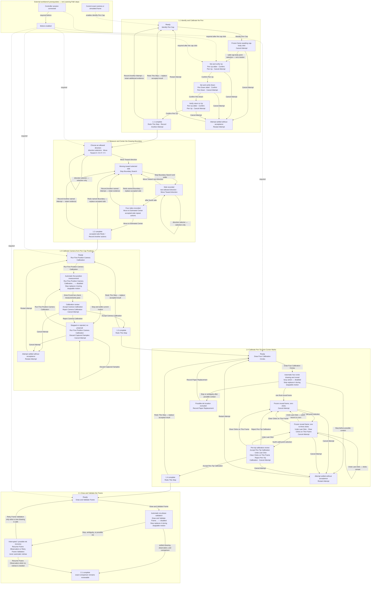

# Learning Path Button Transitions

This diagram inventories every normal Learning Path button and the state reached
by clicking it. **Connect** and **Enable Motion** belong to the workbench
toolbar. They are external prerequisites, not Learning Path stages, exercises,
or transitions.

Dependency behavior is intentionally asymmetric:

- Motion Enabled implies a connected controller session.
- **Identify Pen Cap** requires only a current exact frame.
- After the cap click, **Confirm Pen Up** and the Pen Up slider remain visible
  but disabled until connection and Motion authorization exist.
- Exercises 1.2, 1.3, 1.4, and 2.1 keep their normal action visible and name the
  exact missing workbench prerequisite.
- Satisfying a prerequisite enables the existing action. It never inserts a
  Learning Path **Connect**, **Enable Motion**, generic **Start**, **Next**,
  **Go**, or redundant acceptance step.

The two normal-flow acceptance buttons commit reviewable calibration evidence;
they are not forward gates. **Accept Camera Calibration** commits the
five-position camera calibration. **Accept Pen-Tip Calibration** commits the
four-click pen-tip calibration. Exercises 1.3 and 1.4 begin directly with their
physical actions.
