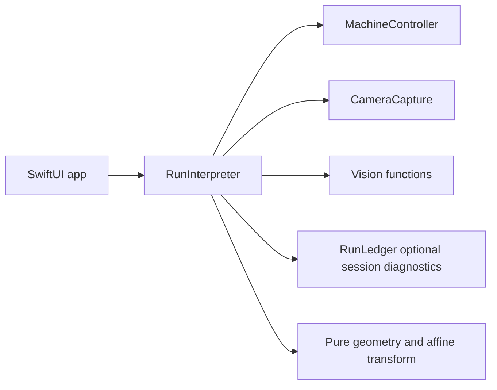

# AdaptivePlotter Minimal Local Architecture

Status: current architecture
Target: this operator Mac and attached plotter only

## 1. Product decision

Build one small native Swift application that can:

1. connect to the plotter controller;
2. show the local camera;
3. preview a vector path;
4. execute the path inside configured bounds;
5. observe the resulting ink after the tool moves clear;
6. display intended versus observed geometry and a simple error.

The application is not a platform, distributed system, calibration framework,
evidence archive, accessibility product, or general adaptive-control research
project.

The vertical slice is the architecture. Anything that does not shorten the
path to that loop is deferred.

## 2. Process and module shape

Use one process and direct typed calls:



Keep the current SwiftPM targets:

```text
PlotterModel       geometry, vector program, affine transform, residuals
PlotterRuntime     controller, camera, current operation, optional session log
PlotterApp         minimal SwiftUI controls and display
PlotterTestSupport focused simulators and fixtures
```

There is no network API, localhost bridge, DTO layer, event bus, service
registry, plugin system, or live Python process.

### Runtime owners

`MachineController` owns:

- the selected serial link;
- raw transmit/receive;
- GRBL parsing;
- controller state, alarm, limits, and outstanding command;
- immediate feed, distance, and workspace validation.

`CameraCapture` owns:

- the selected local camera;
- current capture configuration;
- the latest frame and capture time;
- start, stop, and interruption handling.

`VisionWorker`, or direct pure vision functions where serialization is not
needed, owns:

- measurement of one supplied frame;
- the resulting points, mask, or line geometry;
- no readiness or execution decision.

`RunInterpreter` owns only:

- the current requested operation;
- the current stroke/step;
- whether a command is outstanding;
- the latest controller, camera, and ink result presented to the UI;
- stopping the current run on a concrete error.

It should be a small coordinator, not a workflow engine.

`RunLedger` owns optional current-session diagnostic events. Despite the
retained name, it is not required for controller work, historical product
authority, command recovery, or replay.

The SwiftUI layer owns presentation and operator input. It does not calculate
machine coordinates or send serial bytes directly.

## 3. Development and concurrency

Build with the installed Swift compiler and SwiftPM in Swift 5 compatibility
language mode. Use ordinary actor/MainActor isolation where it helps the code,
but do not require complete strict-concurrency checking or warnings-as-errors
for routine work.

`make build`, `make test`, and `make check` are the supported commands.
`make strict-check` is optional diagnostic work.

No Xcode project, signed app, distribution configuration, CI job, or
cross-machine verification is part of the product. Add a local app wrapper only
if the camera API demonstrates a concrete bundle-identity need.

## 4. Geometry

Keep only coordinate distinctions that prevent real mistakes:

```text
FieldSpace        logical drawing coordinates
MachineSpace      controller X/Y coordinates
CameraPixelSpace  captured image coordinates
PreviewSpace      UI-only coordinates
```

No path may travel from `PreviewSpace` into machine commands.

The first `DrawingProgram` contains stable ordered polyline strokes in
`FieldSpace`. Curves may be flattened into polylines when needed. Do not build a
general vector language before the physical polyline path works.

The initial machine mapping is:

```text
field = A * machine + b + optionalConstantToolOffset
```

The inverse is the affine inverse followed by a forward check and workspace
check. Reject an out-of-bounds point; do not silently clamp it.

No model candidate type, promotion state machine, covariance program, backlash
learner, spline field, pen-mark model, neural model, or general optimizer is
required. Existing unused scaffolding for those concepts is not a contract and
may be removed when encountered.

If the affine transform produces usable drawings, it is complete. Add another
term only after repeated observed ink identifies a specific systematic error
that the affine transform cannot represent.

## 5. Session readiness and command execution

There is no hierarchy of phase gates, action authority records, evidence IDs,
or separate motion/pen arms.

Before enabling machine-affecting controls for a session, check once:

```text
serial device selected
controller responds and is not in alarm
local bounds/feed/distance limits are configured
pen is known up before travel
camera is producing frames if this operation requires observation
```

Recheck only a fact invalidated by disconnect, reset/alarm, configuration
change, manual movement that loses known position, tool change, or camera
change.

Before each machine command, directly validate:

- command belongs to the app's closed command surface;
- feed and distance are within the configured local limits;
- destination is inside the configured workspace;
- pen state is appropriate for travel or drawing;
- no earlier command has an ambiguous outcome.

On correction, the operator can retry immediately in the same app launch.
There is no one-attempt rule and no old-run admission scan.

### Command horizon

Send one bounded operation at a time. Write the command, await its bounded
reply/status, and keep the result in current memory. The optional session log
may mirror raw exchanges but is never on the command path.

`ok` means the controller accepted a command; it does not prove physical motion
or ink. An unknown outcome stops the current run and is never automatically
resent. After interruption, reconnect and query status before starting a new
explicit operation.

## 6. Camera and ink observation

The camera implementation needs:

- a live preview;
- one latest-frame request with capture time;
- one fixed observation region;
- simple baseline/post-frame comparison;
- line or centreline extraction for the chosen ink color;
- intended and observed overlay plus RMS/maximum point or cross-track error.

Start with one fixed clean region and one isolated green line. A result is valid
when the new line is visible and unambiguously associated with the command.
Do not require a general topology system, confidence framework, image corpus,
algorithm version archive, or formal statistical threshold before trying it on
the hardware.

Move the complete pen/holder/linkage/servo assembly pen-up to one known pose
that visibly clears the observation region. The operator may set and verify
that pose in the current live image. Polygon envelopes, a 3D model, and a
field-wide clearance planner are out of scope.

## 7. Best-effort session log

Keep the small SQLite event log only because it is useful for local diagnosis.
It is never a prerequisite for physical writes.

Required tables/data are limited to:

- session/run identity and start time;
- ordered diagnostic events for the current session;
- raw controller exchanges and operation summaries when logging is available.

Use WAL and normal durability. A logging failure is ignored by the controller
path and may be shown as a diagnostic note. It never disables the current
operation, future work, or a new session.

Explicitly out of scope:

- content-addressed evidence blobs;
- frame/artifact manifests;
- run-bundle export;
- recorded-decision replay or UI reconstruction;
- algorithm re-evaluation forks;
- retention classes, quotas, tombstones, and garbage collection;
- cross-launch scanning of all prior journals;
- crash injection at every possible boundary.

Old journal files are diagnostics. A new session may always create a new file.

## 8. Minimal UI

One window is sufficient. It should contain:

- device refresh and explicit serial selection;
- Connect/Probe and, when implemented, Run/Hold/Abort;
- controller status and the last actionable error;
- camera image;
- vector preview;
- current stroke/operation;
- last command outcome;
- intended/observed line and simple error after inspection.

Raw serial text may be available in a small developer disclosure when needed.

Do not build:

- a three-pane workspace;
- model/trial inspectors;
- semantic event timelines;
- replay or history modes;
- storage management UI;
- accessibility-specific behavior or tests;
- operator studies;
- a comprehensive diagnostics subsystem.

Observability means the operator can see what the app is doing now and why the
last operation failed. It does not mean every internal fact needs a durable UI.

## 9. Failure behavior

| Condition | Direct response |
| --- | --- |
| Controller alarm/limit | Stop the current operation; show status; do not auto-clear. |
| Serial disconnect or unknown write outcome | Stop the run; mark the command ambiguous; reconnect and query status before a new operation. |
| Command outside bounds/feed/distance | Refuse that command with the exact value and limit; permit retry after correction. |
| Camera missing/stale for an inspection | Stop inspection, not unrelated controller work; reacquire a frame and retry. |
| Tool still covers observation region | Move pen-up to the known clear pose or adjust hardware; retry capture. |
| Ink missing or unclear | Show the frame/result; do not automatically redraw the same location. |
| Session-log write failure | Continue the operation; show logging as unavailable if useful. |

Software task cancellation is not an emergency stop. `Hold` uses the
controller's feed hold. Emergency stop means the physical power cutoff.

## 10. Tests worth keeping

- GRBL parser fixtures for normal replies, alarms, errors, timeouts, and unknown
  extensions;
- serial fragmentation/disconnect tests;
- immediate workspace/feed/distance validation;
- one session-log test for ordinary diagnostic events and one proving logging
  failure does not block a controller probe;
- affine forward/inverse and out-of-bounds tests;
- drawing-plan ordering tests that keep pen up for travel and clear the tool
  before inspection;
- deterministic frame-selection and simple ink/residual tests;
- one app test proving passive probes can be retried without restart.

Do not require replay-equivalence, archival export, quota, accessibility,
advanced-model, promotion, grouped-holdout, bootstrap, factorial-trial, or
cross-platform tests.

## 11. Delivery order

1. Repeatable live passive controller contact.
2. Live local camera preview.
3. One bounded low-speed pen-up move.
4. Direct pen up/down verification.
5. One isolated line with post-draw image and residual.
6. A small multi-stroke drawing.
7. Portrait-to-vector input through the same path.

This is priority order, not a gate system. Work may cross items when that is the
fastest route to the end-to-end result.

## 12. Retain, remove, defer

Retain:

- native Swift process and direct calls;
- parser/serial implementation;
- bounded local motion checks;
- typed coordinate spaces;
- polyline program and affine transform;
- latest-frame camera/vision path;
- optional current-session diagnostic events;
- no automatic resend/redraw of ambiguous work.

Remove or keep removed:

- one-shot-per-launch passive behavior;
- cross-launch prior-ledger blockers;
- artifact storage/export and full replay reducers;
- accessibility modifiers and requirements;
- mandatory strict-concurrency/warnings-as-errors build flags;
- phase-wide/action-authority ceremony and separate arms.

Defer unless a working drawing proves the need:

- model candidates and promotion UI;
- backlash or pen learning;
- any spline/nonlinear field;
- exhaustive evidence provenance;
- rich observability/history;
- optional tools and generalized source formats.
