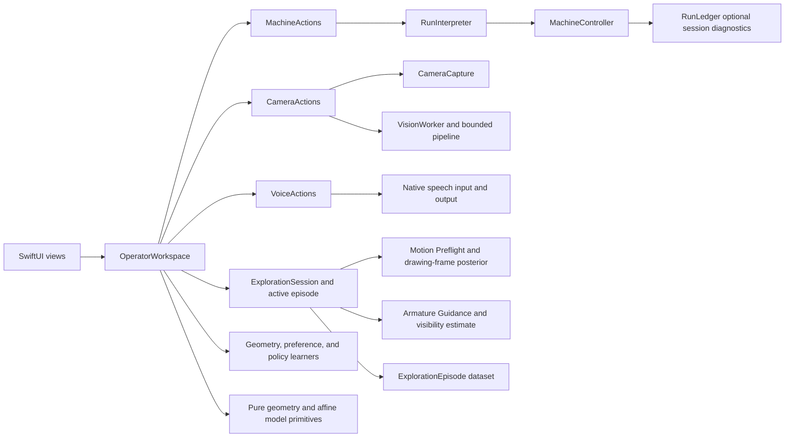

# AdaptivePlotter Minimal Local Architecture

Status: selected target architecture; current implementation differences are recorded separately
Target: this operator Mac and attached plotter only

## 1. Product decision

Build one small native Swift application that can:

1. connect to the plotter controller;
2. show the local camera;
3. keep one voice-mediated ExplorationSession active at the machine;
4. use Motion Preflight and Armature Guidance to learn the current scene through
   action, camera assessment, and human correction;
5. preview and execute a vector path under direct mechanical checks;
6. observe resulting ink after the tool moves clear;
7. display intended versus observed geometry, learn from the residual and
   spoken feedback, and choose a useful next experiment.

The application is not a platform, distributed system, calibration framework,
evidence archive, accessibility product, or general robotics framework. It is
an active-learning drawing controller for this machine.

The vertical slice is the architecture. Anything that does not shorten the
path to that loop is deferred.

## 2. Process and module shape

Use one process and direct typed calls:



Keep the current SwiftPM targets:

```text
PlotterModel       geometry, vector program, affine transform, residuals
PlotterRuntime     controller, camera, current operation, optional session log
PlotterApp         minimal SwiftUI controls and display
PlotterTestSupport focused simulators and fixtures
```

There is no network API, localhost bridge, DTO layer, event bus, service
registry, plugin system, or live Python process.

### Runtime owners

`MachineController` owns:

- the selected serial link;
- raw transmit/receive;
- GRBL parsing;
- controller state, alarms, asserted end-stops, and outstanding command;
- immediate closed-request, finite-delta, feed-capability, pen-state, session-
  activation, in-flight, and ambiguity validation.

`CameraCapture` owns:

- the selected local camera;
- current capture configuration;
- the latest frame and capture time;
- start, stop, and interruption handling.

`VisionWorker`, or direct pure vision functions where serialization is not
needed, owns:

- measurement of one supplied frame;
- the resulting points, mask, or line geometry;
- no readiness or execution decision.

`RunInterpreter` owns only:

- machine-operation coordination above `MachineController`;
- controller selection, inspection, jog/pen/cancel request serialization, and
  the latest machine snapshot presented to the app;
- stopping the current machine operation on a concrete error.

It should be a small coordinator, not a workflow engine.

`OperatorWorkspace` is the MainActor presentation model. It combines the closed
machine, camera, and voice action adapters; owns the ExplorationSession,
Motion Preflight episodes, Armature Guidance, the drawing-frame posterior,
current-session learning datasets, and view-visible state; and never sends
serial bytes or calculates raw controller commands itself.

`RunLedger` owns optional current-session diagnostic events. Despite the
retained name, it is not required for controller work, historical product
authority, command recovery, or replay.

The SwiftUI layer owns presentation and operator input. It does not calculate
machine coordinates or send serial bytes directly.

Native speech is the low-latency operator teaching and reflex adapter, not a
machine authority. `ExplorationSession` starts listening once and maintains the
active episode context across Motion Preflight, Armature Guidance, ink
inspection, and comparison work. There is no separate listening toggle and no
sequence-level microphone teardown.

The reflex parser receives episode state as context. `STOP` is actionable only
while a cancellable typed operation is moving; continue/reverse/directional
intents are actionable only where the episode declares them. A stable partial
`STOP` may cancel immediately. Motion-producing intents require a final or
otherwise stable contextual recognition. The teaching path may accept flexible
visibility, feature, ranking, and reward language, but it records structured
labels and cannot synthesize controller text.

`STOP` in the moving context maps specifically to GRBL Jog Cancel; it is not
feed hold, abort, or an emergency stop. A boundary may be recorded only from a
cancelled jog that reached Idle with a final controller MPos. A jog that reaches
the requested command cap is ordinary completion and must not be presented as a
physical extreme. Spoken output is newest-only, brief, and interrupted by new
operator speech. It describes current typed results and never upgrades
controller acceptance into physical completion.

## 3. Development and concurrency

Build with the installed Swift compiler and SwiftPM in Swift 5 compatibility
language mode. Use ordinary actor/MainActor isolation where it helps the code,
but do not require complete strict-concurrency checking or warnings-as-errors
for routine work.

`make build`, `make test`, and `make check` are the supported commands.
`make strict-check` is optional diagnostic work.

No Xcode project, distribution identity, notarization configuration, CI job, or
cross-machine verification is part of the product. The checked-in build scripts
do assemble a local `.app` and LaunchServices launcher because camera,
microphone, and speech TCC attribution requires a stable application identity.
The bundle uses an available local identity or explicit ad-hoc fallback; this is
local runtime infrastructure, not a release pipeline.

## 4. Geometry

Keep only coordinate distinctions that prevent real mistakes:

```text
FieldSpace        logical drawing coordinates
MachineSpace      controller X/Y coordinates
CameraPixelSpace  captured image coordinates
PreviewSpace      UI-only coordinates
```

No path may travel from `PreviewSpace` into machine commands.

The first `DrawingProgram` contains stable ordered polyline strokes in
`FieldSpace`. Curves may be flattened into polylines when needed. Do not build a
general vector language before the physical polyline path works.

The initial machine mapping is:

```text
field = A * machine + b + optionalConstantToolOffset
```

The inverse is the affine inverse followed by a forward check against the
current learned drawing-frame posterior. That check informs drawing placement
and observation; it is not a global motion-admission bound and is never an
operator-entered coordinate envelope.

The target drawing-frame posterior owns one image-space offset and uncertainty
per selected side. A boundary episode associates its declared side with the
exact post-stop tool centroid and an observation variance; a precision-weighted
update narrows that side's uncertainty, and corner intersections update the
overlay. Final controller MPos is stored as provenance and repeatability context
but is not numerically fused into image geometry without a registration. The
current heuristic quadrilateral average is an implementation gap recorded in
the status document.

Machine-side labels do not intrinsically identify camera edges. For the first
observation of a side, choose the nearest edge from the current frame estimate
only when a uniqueness margin makes the association unambiguous. Persist that
association for the camera configuration, initialize orientation from the
candidate edge and offset with a broad prior variance, and reject ambiguous
association without blocking motion. Camera reconfiguration invalidates it.

The implemented learning surface stays inside this model: one immutable accepted
snapshot, fixed training/holdout observations, deterministic affine candidate
fit, held-out metrics, and one explicit version-increasing acceptance operation.
An online accumulator may propose only at pen-up checkpoints and cannot replace
its accepted snapshot or update a pen-down stroke. No covariance program,
backlash learner, spline field, neural model, or general optimizer is required.

If the affine transform produces usable drawings, it is complete. Add another
term only after repeated observed ink identifies a specific systematic error
that the affine transform cannot represent.

Initial isolated-line residuals remain in `CameraPixelSpace`. Before a physical
ink episode can enter the existing machine-to-`FieldSpace` trainer, the current
camera configuration and accepted frame estimate must produce one cited
`FieldRegistration`. That registration is model provenance, not motion
authority or operator-entered calibration.

This simplicity rule applies to the geometric mapping, not to whether the
product learns. Armature Guidance may maintain a small visibility estimate;
shape comparison may fit a preference model; and a later policy may choose
bounded experiments. Each consumes attributable `ExplorationEpisode` outcomes
and begins with the smallest model appropriate to its objective.

## 5. Direct motion eligibility and command execution

There is no hierarchy of phase gates, action authority records, evidence IDs,
or separate motion/pen arms.

There is one explicit operator arming action: activate Motion Guard for the
connected controller session. It enables no bypass. It permits each typed action
to derive eligibility directly from the current mechanical facts that action
consumes. Motion Preflight completion, learned boundaries, model confidence,
trial counts, and camera availability for a non-visual jog do not participate.

Before each machine command, directly validate:

- command belongs to the app's closed command surface;
- finite nonzero motion and controller-reported axis feed capability;
- no current controller alarm or asserted end-stop;
- pen state is appropriate for travel or drawing;
- no earlier command has an ambiguous outcome.

No operator-entered coordinate envelope or maximum-jog value participates in
activation or per-command admission.

On correction, the operator can retry immediately in the same app launch.
There is no one-attempt rule and no old-run admission scan.

### Command horizon

Send one finite closed operation at a time. Write the command, await its
deadline-bounded reply/status, and keep the result in current memory. The optional session log
may mirror raw exchanges but is never on the command path.

`ok` means the controller accepted a command; it does not prove physical motion
or ink. An unknown outcome stops the current run and is never automatically
resent. After interruption, reconnect and query status before starting a new
explicit operation.

## 6. Camera and ink observation

The camera implementation needs:

- a live preview;
- one latest-frame request with capture time;
- one fixed observation region;
- clean-reference/anchor-baseline/post-line comparison;
- line or centreline extraction for the chosen ink color;
- intended and observed overlay plus RMS/maximum point or cross-track error.

Start with one fixed clean region and one isolated green line. A result is valid
when the new line is visible and unambiguously associated with the command.
Do not require a general topology system, confidence framework, image corpus,
algorithm version archive, or formal statistical threshold before trying it on
the hardware.

Absolute camera-space error needs a start anchor. Capture the clean reference,
create one stationary Pen Down/Pen Up dot at the recorded start MPos, return
clear, and capture the anchored baseline. The dot centroid anchors the intended
line; the current response matrix projects its stroke delta. Use the anchored
baseline for line differencing. Without anchor or projection, report only
relative displacement/orientation and label absolute residual unavailable.

Move the complete pen/holder/linkage/servo assembly pen-up to one known pose
that visibly clears the observation region. The operator may set and verify
that pose in the current live image. Polygon envelopes, a 3D model, and a
field-wide clearance planner are out of scope.

## 7. Best-effort session log

Keep the small SQLite event log only because it is useful for local diagnosis.
It is never a prerequisite for physical writes.

Required tables/data are limited to:

- session/run identity and start time;
- ordered diagnostic events for the current session;
- raw controller exchanges and operation summaries when logging is available.

Use WAL and normal durability. A logging failure is ignored by the controller
path and may be shown as a diagnostic note. It never disables the current
operation, future work, or a new session.

Explicitly out of scope:

- content-addressed evidence blobs;
- frame/artifact manifests;
- run-bundle export;
- recorded-decision replay or UI reconstruction;
- algorithm re-evaluation forks;
- retention classes, quotas, tombstones, and garbage collection;
- cross-launch scanning of all prior journals;
- crash injection at every possible boundary.

Old journal files are diagnostics. A new session may always create a new file.

## 8. Minimal UI

Use one primary operator window and one Learning utility window backed by the
same `OperatorWorkspace`. The primary window contains:

- one serial-device picker that remembers the last selection without treating
  selection as connection;
- one explicit Connect action whose connected presentation requires a
  successful blocker-free passive inspection;
- compact current camera-live, plotter-connected, and motion-guard indicators;
- controller status and the last actionable error;
- camera image;
- vector preview;
- current stroke/operation;
- last command outcome;
- intended/observed line and simple error after inspection;
- persistent ExplorationSession permission/listening/transcript/context state;
- Motion Preflight and Armature Guidance active-episode timelines, latest
  machine/vision assessment, human label, and visible cancel fallback;
- a SIMULATED-source rehearsal of those exact typed timelines with an explicit
  silent/voice checkbox. The silent path uses deterministic playback; the voice
  path may acquire the microphone to practice human timing and context-bound
  phrases. Neither path can reach the controller, create physical evidence, or
  affect motion eligibility.

Raw serial text may be available in a small developer disclosure when needed.

Do not build:

- a three-pane workspace;
- historical or generalized model/trial inspectors;
- historical semantic timelines or replay; the active episode timeline remains;
- replay or history modes;
- storage management UI;
- accessibility-specific behavior or tests;
- operator studies;
- a comprehensive diagnostics subsystem.

Observability means the operator can see what the app is doing now and why the
last operation failed. It does not mean every internal fact needs a durable UI.
A current-session learning workbench and live throughput counters are in scope:
they make frame recognition, controller pairing, fixed split assignment,
candidate fitting, held-out comparison, and explicit pen-up acceptance visible
without creating history, replay, or a generalized model platform.

## 9. Failure behavior

| Condition | Direct response |
| --- | --- |
| Controller alarm/limit | Stop the current operation; show status; do not auto-clear. |
| Serial disconnect or unknown write outcome | Stop the run; mark the command ambiguous; reconnect and query status before a new operation. |
| Motion Guard inactive or request exceeds controller-reported feed capability | Refuse that command with the current reason; permit retry after activation or correction. |
| Camera missing/stale for an inspection | Stop inspection, not unrelated controller work; reacquire a frame and retry. |
| Tool still covers observation region | Move pen-up to the known clear pose or adjust hardware; retry capture. |
| Ink missing or unclear | Show the frame/result; do not automatically redraw the same location. |
| Session-log write failure | Continue the operation; show logging as unavailable if useful. |

Software `STOP`/Cancel Stroke uses the typed Jog Cancel path for the current jog
or stroke. It is not feed hold or an emergency stop. Emergency stop means the
physical power cutoff.

The context-bound boundary interaction requires physical validation on the
attached plotter before prompt timing, cancellation latency, or recorded final
MPos values can be claimed as observed behavior.

## 10. Tests worth keeping

- GRBL parser fixtures for normal replies, alarms, errors, timeouts, and unknown
  extensions;
- serial fragmentation/disconnect tests;
- Motion Guard, controller feed-capability, alarm/end-stop, and ambiguity validation;
- ExplorationSession lifetime, barge-in, contextual reflex routing, and
  teaching-label tests;
- Armature Guidance clear/partial/blocked label and active-pose tests;
- one session-log test for ordinary diagnostic events and one proving logging
  failure does not block a controller probe;
- affine forward/inverse and out-of-bounds tests;
- drawing-plan ordering tests that keep pen up for travel and clear the tool
  before inspection;
- exact-frame identity, pixel-format/stride, and simple ink/residual tests;
- one app test proving passive probes can be retried without restart.

Do not require replay-equivalence, archival export, quota, accessibility,
advanced-model, bootstrap, factorial-trial, or cross-platform tests. Do test the
small affine learner's split isolation, held-out rejection, explicit immutable
acceptance, and pen-down model pinning because those are now working runtime
contracts.

## 11. Delivery order

1. Keep one ExplorationSession listening through multiple simulated episodes.
2. Exercise Motion Preflight and Jog Cancel through that session on hardware.
3. Teach one clear pose through Armature Guidance.
4. Draw one isolated line and show its exact-frame residual.
5. Collect spoken comparisons over several stroke/shape candidates.
6. Let active selection choose informative experiments, then evaluate a bounded
   policy against the deterministic baseline.
7. Run a small multi-stroke drawing with passive human supervision.

This is priority order, not a gate system. Work may cross items when that is the
fastest route to the end-to-end result.

## 12. Retain, remove, defer

Retain:

- native Swift process and direct calls;
- parser/serial implementation;
- direct mechanical motion checks on finite closed operations;
- typed coordinate spaces;
- polyline program and affine transform;
- immutable affine snapshots, deterministic training/holdout evaluation, and
  checkpoint-only candidate proposal;
- latest-frame camera/vision path;
- optional current-session diagnostic events;
- no automatic resend/redraw of ambiguous work.

Remove or keep removed:

- one-shot-per-launch passive behavior;
- cross-launch prior-ledger blockers;
- artifact storage/export and full replay reducers;
- accessibility modifiers and requirements;
- mandatory strict-concurrency/warnings-as-errors build flags;
- phase-wide/action-authority ceremony and separate arms.

Defer until attributable outcomes prove the need:

- generalized model families and promotion UI;
- backlash or pen learning;
- any spline/nonlinear field;
- exhaustive evidence provenance;
- rich observability/history;
- optional tools and generalized source formats.

Do not defer the learning ladder itself. Preference learning and bounded policy
optimization are intended later rungs once isolated ink and comparison episodes
provide valid transitions and rewards.
